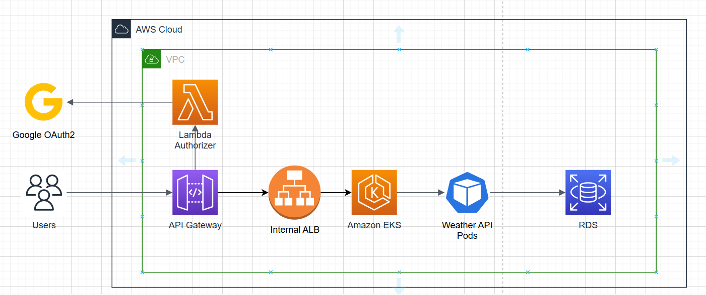

# Sample project(weather API)
Application Architect

- AWS API gateway with Lambda authorizer (Google Oauth2), integrate with EKS service
- AWS EKS to host backend service
- EKS service logs will be shipped to AWS cloudwatch logs
- Use Jenkins pipeline for CI/CD
- Use terraform to provision all AWS resources

## Getting Started

### Prerequisites
List any software, libraries, or hardware needed to run this project.
 - **AWS account**
 - **Terraform** : Provision AWS resources
 - **Jenkins server** : CI/CD pipeline
 - **kubectl**: Connect to EKS cluster and take action on it

### Installing
#### Provision AWS resources
- cd terraform
- terraform init
- terraform plan -var-file="environments/dev/tfvars"
- terraform apply -var-file="environments/dev/tfvars"

This is to provision resources for dev environment. You can do same for other environment by adding new tfvars file to environments folder

#### Deploy Fluent-bit to ship EKS cluster logs to AWS Cloudwatch

- cd k8s-resources/
- kubectl apply -f logging

#### Jenkins jobs
Jenkins pipeline is defined in: jenkins/pipeline.groovy file
Assume that we have 3 environments: dev, uat and production.
- For Dev environment, the Jenkins job will be automatically triggered when we have new commit to develop branch. We can re-deploy manually if need
- For UAT, pipeline is only triggered when we create a new git tag with format like: v1.0.1-beta
- For production, we  need to create a new tag with format like: v1.0.1. And the job should be triggered manually for safe. And only allow project manager to trigger it

Jenkins pipeline already included some stage to scan the source code with Sonarqube, scan gitleak and Snyk to scan the container image. If one of these step is failed, the pipeline will be blocked 

#### Backend k8s manifest
See in k8s-resources/backend folder
We have:
- deployment.yaml
- service.yaml
- hpa.yaml: Autoscaling 
#### Ngin ingress to integrate with internal AWS ALB
##### Create NGINX Ingress with AWS Internal Load Balancer using helm

- helm repo add ingress-nginx https://kubernetes.github.io/ingress-nginx
- helm repo update
- cd k8s-resources/ingress
- helm install ingress-nginx ingress-nginx/ingress-nginx \
        -f internal-lb-values.yaml \
        --namespace ingress-nginx \
        --create-namespace

##### Create nginx ingress to expose backend
- cd k8s-resources/ingress
- kubectl apply -f ingress.yaml

